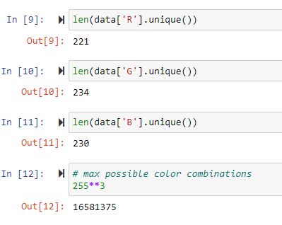

Color Detection - Overview
==========================
- Created a model to detect color name of the clicked co-ordinates in the image/video frame

Installation
------------
Following will be required to use the template:
- **Python version:** 3.10   
- **Packages:** numpy, pandas, matplotlib, seaborn, cv2  

**Data Source:** https://github.com/codebrainz/color-names

Usage
-----
To use this model, you can simply run the code directly or integrate this into some other app

Project Structure
-----------------

    ├── LICENSE
    ├── README.md          <- The top-level README for developers using this project.
    ├── data
    │   ├── external       <- Data from third party sources.
    │   ├── interim        <- Intermediate data that has been transformed.
    │   ├── processed      <- The final, canonical data sets for modeling.
    │   └── raw            <- The original, immutable data dump.
    │
    │
    ├── models             <- Trained and serialized models, model predictions, or model summaries
    │
    ├── notebooks          <- Jupyter notebooks. Naming convention is a number (for ordering),
    │                         the creator's initials, and a short `-` delimited description, e.g.
    │                         `1.0-jqp-initial-data-exploration`.
    │
    ├── reports            <- Generated analysis as HTML, PDF, LaTeX, etc.
    │   └── figures        <- Generated graphics and figures to be used in reporting
    │
    └── requirements.txt   <- The requirements file for reproducing the analysis environment, e.g.

Data Information
----------------
The data had the following columns:   
- Color
- Hex
- R
- G
- B

Exploratory Data Analysis 
-------------------------
After looking at the data I reached to the following conclusion:    
- The data had only 865 entries and the total possible combinations of colors are 16581375. 

Model Building
--------------
The model consists of following steps:
- Load image/video frame
- Read image/video frame
- Use mouse callback to capture clicked xy co-ordinates in the image/video frame
- Use the distance formula to determine the color name
- Display the color on the image/video frame

Model Performance
-----------------
Here is how the model performed:

License
-------
Copyright (c) 2022 Hamza-Farrukh   
This project is [MIT](LICENCE "LICENSE") licensed.
